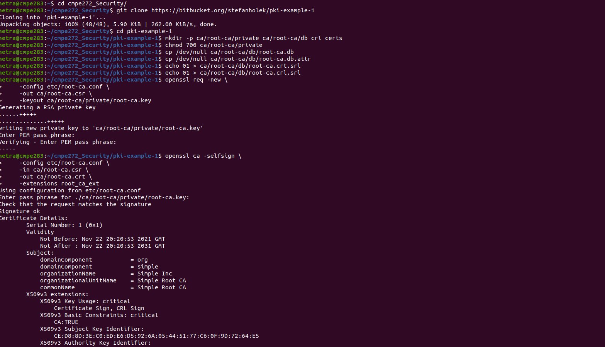

# Assignment 7 : Security
 - Team Name : Hakkuna Matata
 - Team Memebers : Zi Shun Yang, Rohan Patel,  Netra Amrale, Govinder Somal
 
 # Steps 
 - Clone repo and create root CA

    
    
    
 -  Create operating CA   
    
- Create TLS Certificate    
    
- Revoke certificate    
    
- Create PKC12 certificate    

- Create keystore
- Verify certificate in keystore 
    
      
- Add entry in /etc/tomcat9/server.xml
        
- Restart tomcat server
    
- Now, tomcat server runs successfully on HTTPS
      

